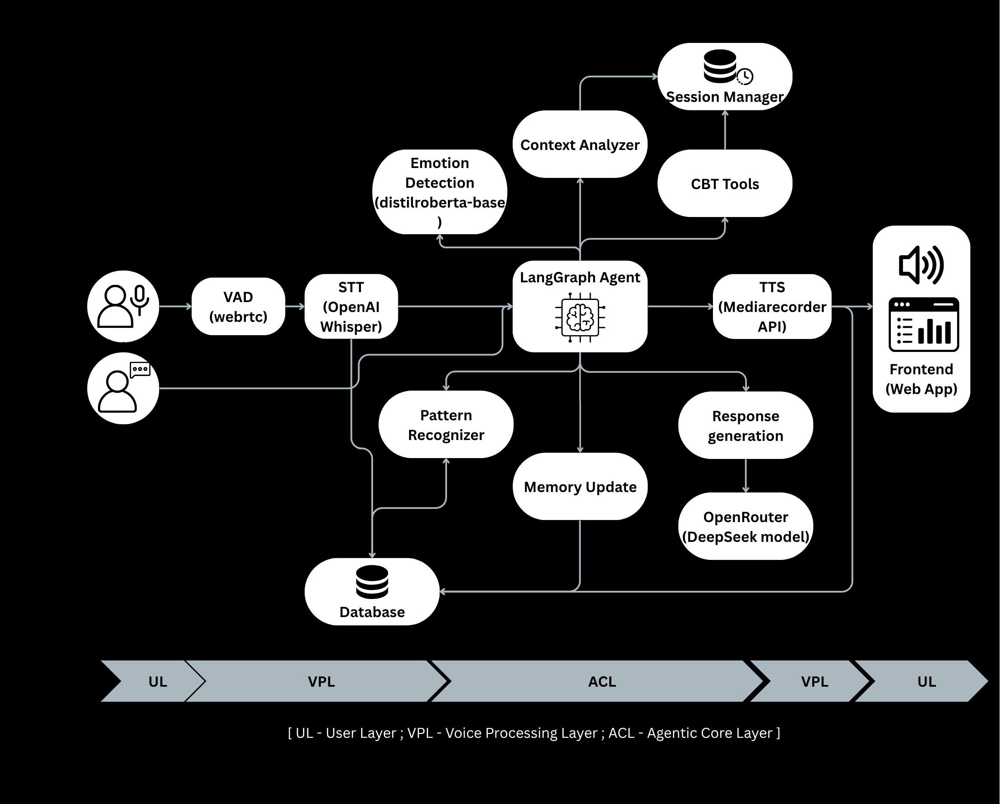

## System Architecture

This diagram illustrates the internal workings of the TheraSage emotional support platform, a deeply integrated system that handles both **text and voice inputs**, applies **intelligent flow logic with LangGraph**, and offers **emotionally aware, CBT-guided responses** powered by LLMs.

### Input Flow

- **Text Input**  
    If the user sends a text message, it is directly routed to the core LangGraph pipeline for processing.
- **Voice Input**  
    Voice messages go through:
    - **VAD (Voice Activity Detection)** using `WebRTC` to confirm if speech exists.
    - **STT (Speech-to-Text)** via OpenAI's `Whisper` model to convert spoken words into text.

### LangGraph Chain

Once the message is ready (from either input mode), it enters a series of LangGraph nodes, each responsible for a specific part of the emotional intelligence pipeline:

1. **Emotion Detection**  
    Utilizes `distilroberta-base` to determine the emotional tone of the user's message (e.g., anxious, sad, angry, etc.).
2. **Context (Depth) Analyzer**  
    This node evaluates the **session's emotional depth** — how much the user has opened up, how sensitive or serious the conversation is — with help from the **Session Manager**, which tracks the conversation's progression.
3. **CBT Trigger Decision**  
    Determines if the conversation has reached sufficient emotional depth to introduce **Cognitive Behavioral Therapy (CBT)** tools. This decision is made implicitly without user prompts.
4. **CBT Tool Recommender**  
    If needed, it suggests relevant CBT tools (e.g., cognitive distortions, reframing techniques). These tools are suggested **indirectly** within the generated response to maintain a human touch.
5. **Pattern Recognizer**  
    Observes for recurring **themes, triggers, or behavioral loops** across the session to aid better journaling and personalized responses.
6. **Journaling Node (Memory Update)**   
    Automatically summarizes and logs:
    - Negative thoughts, patterns
    - Positive reflections
    - CBT insights  
        This is stored in a **persistent SQLite database** to maintain long-term user context.
7. **Response Generation**  
    Pulls together emotional state, CBT insights, session depth, and past patterns to generate a **warm, empathetic reply** using LLMs hosted on OpenRouter (e.g., DeepSeek models).

### Output Flow

- The final response is:
    - **Displayed to the user** in the chat interface
    - **Read aloud** via the browser using the `MediaRecorder API` for **Text-to-Speech (TTS)**, if the user enables the voice output feature.

---
